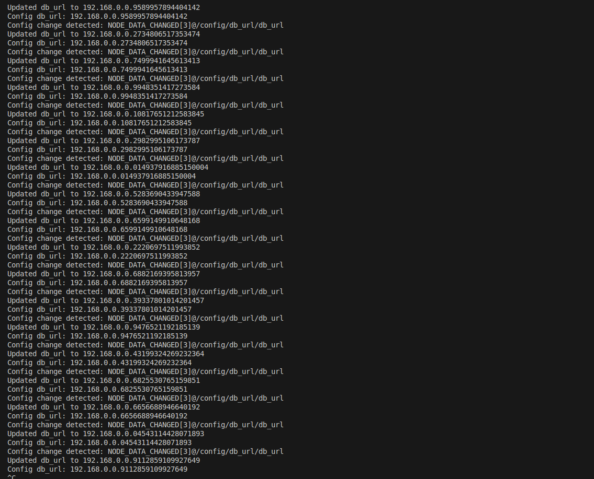

# Distributed configuration manager

# Step 1: Setting Up a ZooKeeper Ensemble

## **1. Introduction**
A **ZooKeeper ensemble** is a group of ZooKeeper servers working together to maintain a consistent distributed system. This guide outlines the steps to set up a **3-node ZooKeeper ensemble** on a single machine (localhost) or across multiple nodes.

---

## **2. Prerequisites**
- **ZooKeeper installed** on your system.
- If running on **Windows**, configure multiple ZooKeeper instances.
- If using **Ubuntu (local or EC2)**, configure three instances.

---

## **3. Configure a 3-Node ZooKeeper Cluster**

### **Step 1: Create Configuration Directories**
Each ZooKeeper instance needs a separate configuration. Run the following command to create directories:

```sh
mkdir -p ~/zookeeper/node1 ~/zookeeper/node2 ~/zookeeper/node3
```

### **Step 2: Configure Each Node**
Each node needs its own configuration file.

#### **Node 1 Configuration (zoo1.cfg)**
Create `zoo1.cfg` inside `~/zookeeper/node1/conf/`:

```ini
tickTime=2000
initLimit=10
syncLimit=5
dataDir=/home/user/zookeeper/node1/data
clientPort=2181
server.1=127.0.0.1:2888:3888
server.2=127.0.0.1:2889:3889
server.3=127.0.0.1:2890:3890
```

#### **Node 2 Configuration (zoo2.cfg)**
Create `zoo2.cfg` inside `~/zookeeper/node2/conf/`:

```ini
tickTime=2000
initLimit=10
syncLimit=5
dataDir=/home/user/zookeeper/node2/data
clientPort=2182
server.1=127.0.0.1:2888:3888
server.2=127.0.0.1:2889:3889
server.3=127.0.0.1:2890:3890
```

#### **Node 3 Configuration (zoo3.cfg)**
Create `zoo3.cfg` inside `~/zookeeper/node3/conf/`:

```ini
tickTime=2000
initLimit=10
syncLimit=5
dataDir=/home/user/zookeeper/node3/data
clientPort=2183
server.1=127.0.0.1:2888:3888
server.2=127.0.0.1:2889:3889
server.3=127.0.0.1:2890:3890
```

---

### **Step 3: Assign Unique Server IDs**
Each ZooKeeper instance requires a unique `myid` file in its `dataDir`. Run:

```sh
echo "1" | sudo tee ~/zookeeper/node1/data/myid > /dev/null
echo "2" | sudo tee ~/zookeeper/node2/data/myid > /dev/null
echo "3" | sudo tee ~/zookeeper/node3/data/myid > /dev/null
```

---

## **4. Fix Permission Issues (If Needed)**
If you encounter permission errors, run the following:

```sh
sudo chown -R $USER:$USER ~/zookeeper/node1/data
sudo chown -R $USER:$USER ~/zookeeper/node2/data
sudo chown -R $USER:$USER ~/zookeeper/node3/data
chmod -R 755 ~/zookeeper/node1/data
chmod -R 755 ~/zookeeper/node2/data
chmod -R 755 ~/zookeeper/node3/data
```

---

## **5. Start the ZooKeeper Ensemble**
Run the following commands to start each ZooKeeper instance:

```sh
zkServer.sh start ~/zookeeper/node1/conf/zoo1.cfg
zkServer.sh start ~/zookeeper/node2/conf/zoo2.cfg
zkServer.sh start ~/zookeeper/node3/conf/zoo3.cfg
```

Check the status of each instance:

```sh
zkServer.sh status ~/zookeeper/node1/conf/zoo1.cfg
zkServer.sh status ~/zookeeper/node2/conf/zoo2.cfg
zkServer.sh status ~/zookeeper/node3/conf/zoo3.cfg
```

One of the nodes should be elected as the **Leader**, and the others should be **Followers**.

---

## **6. Verify Ensemble Setup**
Use the ZooKeeper CLI to connect to any node:

```sh
zkCli.sh -server 127.0.0.1:2181
```

Check the cluster status:

```sh
ls /
```

If everything is working correctly, the connection should be successful.

---

## **7. Troubleshooting**

### **Issue: Permission Denied While Creating `myid` File**
Error:
```sh
bash: /usr/local/zookeeper/node1/data/myid: Permission denied
```
Solution:
```sh
sudo chown -R $USER:$USER ~/zookeeper/node1/data
```

### **Issue: Permission Denied While Starting ZooKeeper**
Error:
```sh
FAILED TO WRITE PID
```
Solution:
```sh
sudo chown -R $USER:$USER ~/zookeeper/node1/data
chmod -R 755 ~/zookeeper/node1/data
```

### **Issue: ZooKeeper Not Starting**
Check logs:
```sh
tail -f ~/zookeeper/node1/data/zookeeper.out
```

---

Great! Now that our **ZooKeeper ensemble** is running, let's move on to **Step 2: Creating Configuration Nodes**.

---

# **Step 2: Create Configuration Nodes in ZooKeeper**
A **configuration node** is a **ZNode** in ZooKeeper that stores application settings. Clients can read or update configurations dynamically.

### **2.1 Choose a Configuration Structure**
We'll store configurations under `/config` as follows:

```
/config
 ├── /config/db_url       (Database connection string)
 ├── /config/feature_flag (Feature toggle)
 ├── /config/max_threads  (Thread pool size)
```

---

### **2.2 Connect to ZooKeeper**
Open the ZooKeeper CLI:

```sh
zkCli.sh -server 127.0.0.1:2181
```

If you're using multiple nodes, connect to any of them.

---

### **2.3 Create the Root Configuration Node**
Create the `/config` parent node:

```sh
create /config "Application Configurations"
```

Verify:

```sh
ls /
```

Expected output:

```
[config, zookeeper]
```

---

### **2.4 Create Individual Configuration Nodes**
Now, let's add specific configuration values.

#### **2.4.1 Add a Database URL**
```sh
create /config/db_url "jdbc:mysql://localhost:3306/app_db"
```

#### **2.4.2 Add a Feature Flag**
```sh
create /config/feature_flag "true"
```

#### **2.4.3 Add a Max Thread Count**
```sh
create /config/max_threads "10"
```

---

### **2.5 Verify the Configuration Nodes**
List all configurations under `/config`:

```sh
ls /config
```

Expected output:

```
[db_url, feature_flag, max_threads]
```

Retrieve a configuration value:

```sh
get /config/db_url
```

Expected output:

```
jdbc:mysql://localhost:3306/app_db
```

---


Great! You've enhanced the script by:  
✅ Ensuring that configuration nodes exist before reading.  
✅ Setting up **watchers** to detect configuration changes.  
✅ Automatically updating the configuration every 5 seconds.  

Now, let's move to **Step 4: Add Watchers for Configuration Changes** properly.

---

## **Step 4: Add Watchers for Configuration Changes**
ZooKeeper **watchers** notify clients when a configuration changes. Instead of polling, clients react to real-time updates.

---

### **4.1 Update the Script to Use Watchers**
Modify your `readConfig` function to **set a watcher**:

```javascript
function watchConfig(key) {
    const path = `${configPath}/${key}`;

    client.getData(path, (event) => {
        console.log(`Config change detected for ${key}:`, event);
        watchConfig(key); // Re-add the watcher after change
    }, (error, data) => {
        if (error) {
            console.error(`Error reading ${key}:`, error);
            return;
        }
        console.log(`Config ${key}: ${data ? data.toString() : 'null'}`);
    });
}
```

---

### **4.2 Modify `readConfig` to Use Watchers**
Update the `readConfig` function to call `watchConfig`:

```javascript
function readConfig(key, defaultValue = '') {
    ensureZNodeExists(`${configPath}/${key}`, defaultValue);
    watchConfig(key);
}
```

---

### **4.3 Run the Script**
Save your changes and run:

```sh
node zookeeper-config.js
```

Then, manually change the config in the ZooKeeper CLI:

```sh
zkCli.sh -server 127.0.0.1:2181
set /config/db_url "192.168.1.100"
```

Your Node.js application should **immediately detect** the change and print:

```
Config change detected for db_url: { ... }
Config db_url: 192.168.1.100
```

---

### **4.4 Next Steps**
Now that our **watchers** are working, the final step is **Step 5: Test the System with Multiple Nodes**.

Let me know once you’re ready, and we’ll simulate a **multi-node system** where multiple clients react to config updates! 🚀

### **Step 5: Test the System with Multiple Nodes**  
Now that we have implemented configuration retrieval, updates, and watchers, let's **simulate multiple clients** reacting to configuration changes in real-time.

---

## **5.1 Goal**  
✅ Run multiple instances of our ZooKeeper client.  
✅ Ensure all instances detect **configuration changes in real-time**.  
✅ Verify that **changes made in one client are reflected in others**.

---

## **5.2 Modify the Script for Multi-Client Setup**  
Let's create **two separate Node.js clients** that will read and watch the same config node.

---

### **Client 1: Configuration Reader & Watcher**
📌 **`client1.js`** (Reads and watches the `/config/db_url` ZNode)
```javascript
const zookeeper = require('node-zookeeper-client');

const client = zookeeper.createClient('127.0.0.1:2181');
const configPath = '/config/db_url';

client.connect();

client.once('connected', () => {
    console.log('Client 1 Connected to ZooKeeper');

    function watchConfig() {
        client.getData(configPath, (event) => {
            console.log('Client 1: Config change detected:', event);
            watchConfig(); // Re-attach the watcher
        }, (error, data) => {
            if (error) {
                console.error('Client 1: Error reading config:', error);
                return;
            }
            console.log(`Client 1: Config Value: ${data ? data.toString() : 'null'}`);
        });
    }

    watchConfig(); // Start watching
});
```

---

### **Client 2: Configuration Updater**
📌 **`client2.js`** (Updates `/config/db_url` every 5 seconds)
```javascript
const zookeeper = require('node-zookeeper-client');

const client = zookeeper.createClient('127.0.0.1:2181');
const configPath = '/config/db_url';

client.connect();

client.once('connected', () => {
    console.log('Client 2 Connected to ZooKeeper');

    function updateConfig() {
        const newValue = `192.168.0.${Math.floor(Math.random() * 100)}`;
        client.setData(configPath, Buffer.from(newValue), (error) => {
            if (error) {
                console.error('Client 2: Error updating config:', error);
            } else {
                console.log(`Client 2: Updated Config Value to: ${newValue}`);
            }
        });
    }

    setInterval(updateConfig, 5000); // Update config every 5 seconds
});
```

---

## **5.3 Running the Clients**  
Open **two terminal windows** and run:

### **Terminal 1: Run the Watcher Client**
```sh
node client1.js
```
Expected Output:
```
Client 1 Connected to ZooKeeper
Client 1: Config Value: 127.0.0.1
```

---

### **Terminal 2: Run the Updater Client**
```sh
node client2.js
```
Expected Output:
```
Client 2 Connected to ZooKeeper
Client 2: Updated Config Value to: 192.168.0.42
```

---

### **5.4 Observe Real-Time Config Updates**  
Each time **Client 2 updates the config**, **Client 1 should detect it automatically**.

Expected **Client 1 Output**:
```
Client 1: Config change detected
Client 1: Config Value: 192.168.0.42
```
```
Client 1: Config change detected
Client 1: Config Value: 192.168.0.77
```

---

## **5.5 Manually Update from ZooKeeper CLI**
1. Open a terminal and run:
   ```sh
   zkCli.sh -server 127.0.0.1:2181
   ```
2. Update the value manually:
   ```sh
   set /config/db_url "192.168.1.100"
   ```
3. **Client 1** should immediately detect the change:
   ```
   Client 1: Config change detected
   Client 1: Config Value: 192.168.1.100
   ```

---

## **🎉 Step 5 Completed!**
Now, we have:
✅ **Multiple clients** connected to ZooKeeper.  
✅ **Real-time config updates** across all nodes.  
✅ **Manual updates detected instantly.**

---
